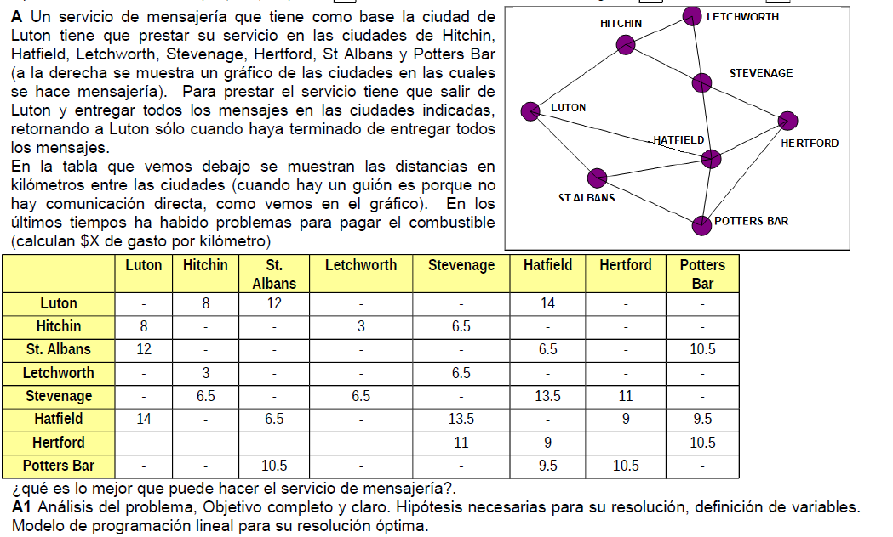
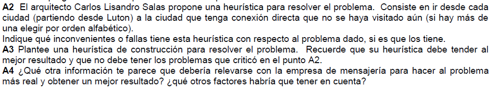

# Examen Final 
## 13/2/13

@deadpulTeam

### Modelo de programación lineal
#### Enunciado

  

#### Análisis de la situación problemática :point_left:

Es una variación del problema del viajante. Se sale del Luton y se arriba al mismo lugar, teniendo que pasar por todos los aeropuertos sin repetir. La particularidad está en que de tdos las ciudades no se pueden ir a todas las ciudades. 

#### Objetivo :innocent:

Determinar en qué orden deben visitarse las ciudades para que en una sola jornada se visiten todos las ciudades minimizando el gasto de combustible por kilómetro. 

#### Hipótesis y supuestos :sweat_smile:

- Los gastos no mencionados no son limitantes. 
- Todos los caminos están disponibles en ambos sentidos.
- Todos los caminos pueden visitarse en cualquier momento.
- No hay contratiempos en el camino.
- **Cada región se visita una sóla vez**. 
- El costo por kilómetro se mantiene fijo. 
- Los costos no varían ni hay inflación. 

#### Constantes :see_no_evil:

Dado el siugiente conjunto de ciudades: 

$$
CIU =  \{Luton, Hithchin, ..., Potters Bar\}
$$

- $d_{i,j}$: la distancia de ir de la ciudad i a la j directamente. $\forall i,j \in CIU$
- $\$X$: costo por kilómetro.,

#### Variables 

- $X_{i,j}$: (*bivalente*) vale 1 si el viajante va de i a j directamente. $\forall i,j \in CIU$
- $U_{i}$: (*entera, aunque puede definirse como continua*) el número de orden en el que se visita la ciudad i.  $\forall i\in CIU$

#### Modelo de programación lineal :skull:

:bulb: Para todas las ciudades en las que no existe un camino directo les forzamos el cero a la variable $X_{i,j}$. 

Por ejemplo: 
$$
    X_{lutton,pottersBar} = 0
$$

Condiciones clasicas del viajante: 

$$
\sum_{i \in CIU} X_{i,j} = 1\ \forall j \in CIU
$$

$$
\sum_{j \in CIU} X_{i,j} = 1\ \forall i \in CIU
$$

Condición para evitar sub-tours:
:warning: estás condiciones **NO** deben incluír al origen

$$
U_j - U_i + n X_{i,j} \le n-1 \  \forall i,j \in \{\{CIU\} - \{lutton\}\}
$$

Funcional:
$$
\sum_{i\in CIU}\sum_{j\in CIU}\$X  d_{i,j} X_{i,j} 
$$

### Heurística 

  

#### Críticas 

- Es una Heurística greedy, se parece a la del vecino más cercano. 
- No indica volver a LUTON.
- Puede ser incompatible.
- No minimiza la distancia. 
- No indica que deba visitar a todas las ciudades.

#### Nueva heurística

Para resolver nuestro problema podemos usar la **heurística de inserción más cercana**. 

- Comenzar con un subtour con Luton
- Mientras queden ciudades por visitar. 
- Armar un nuevo subtour, con una ciudad más al menor costo posible. Para cada candidata  a agregar se calcula la diferencia de costo entre el tour anterior y el obtenido con el agregado de esta nueva ciudad. 
- Si no se puede seguir volver para atras y probar con otro nodo un nuevo subtour. **Esto es porque no se puede ir de todas a todas**
