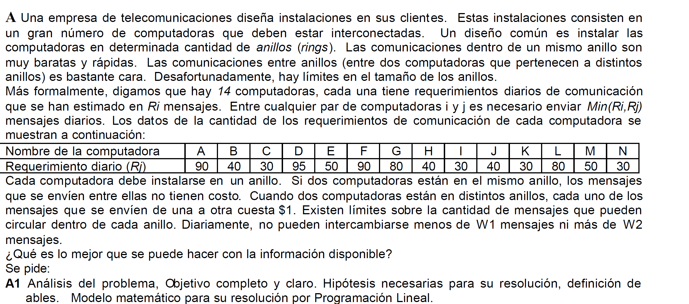
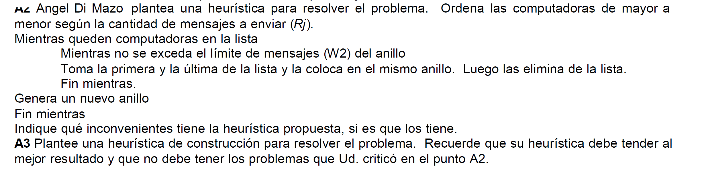

# Examen Final 
## 3/2/10

@deadpulTeam

### Modelo de programación lineal
#### Enunciado

  

#### Análisis de la situación problemática :point_left:

Es un problema de **asignación cuadrática** en donde se deben asignar computadoras a anillos. Se conoce la frecuencia de comunicación entre las compuntadoras y el costo de comunicación entre anillos.  

#### Objetivo :innocent:

Determinar en qué anillo se instala cada computadora (A - N) para minimizar el costo de comunicación diario entre cada computadora. 

#### Hipótesis y supuestos :sweat_smile:

- No existen otros costos a los mencionados. Los costos no varían ni hay inflación. 
- Existe un número finito de anillos. Como máximo tomo n que es la cantidad de computadoras. 
- Las comunicaciones entre anillos nunca fallan. 
- Las instalaciones no fallan y las computadoras tampoco. 
- Existe un encargado en la instalación de las computadoras. 
- No todos los anillos deben tener computadoras. 

#### Constantes :see_no_evil:

$$
COMPUTADORAS = \{A,B, ..., N\}
$$

$$
ANILLOS = \{a,b, ... , n\}
$$

$$
\forall i, j \in COMPUTADORAS
$$

$$
\forall a,b \in ANILLOS
$$

- $R_i$: Requerimientos diarios de comunicación para la computadora i. 
- $C_{a,b}$: costo de mensaje entre anillos a y b. (Vale 1 si son distintos anillos y 0 si son del mismo anillo. )
- $C_{i,a,j,b}$: el costo de comunicación de la computadora i ubicada en el anillo a con la computadora j en el anillo b. 
$$
C_{i,a,j,b} = MIN(R_i, R_j) * C_{a,b}
$$
- $W_1$ Cantidad de mensajes mínima entre computadoras de un mismo anillo. 
- $W_2$ Cantidad de mensajes máxima entre computadoras de un mismo anillo. 

#### Variables 

(*Bivalentes*)
- $X_{i,a}$: vale 1 si se instala la computadora i en el anillo a. 
- $Y_{i,a,j,b}$: vale 1 si se instala la computadora i en a y la computadora j en b. 

#### Modelo de programación lineal :skull:

*A todo problema se le asigna un anillo*
:warning: Sigue siendo un problema de asignación, entonces, debe estar la **restricción de asignación**
$$
\forall i \in COMPUTADORAS \sum_{a \in ANILLOS} X_{i,a} = 1
$$

*AND para la apertura de variables*
:unicorn: acá está la magia de lo **cuadrático**

$$
\forall i, j \in COMPUTADORAS
$$

$$
\forall a,b \in ANILLOS
$$

$$
2 Y_{i,a,j,b} \le X_{i,a} + X_{j,b} \le 1 + Y_{i,a,j,b}
$$

Restricciones de la cantidad de mensajes por anillo. **Spoiler alert**: sin estas restricciones, pondría todas las computadoras en un anillo :scream:

$$
\forall a \in ANILLOS\ \ \ 2 W_1 \le \sum_{i \in COMPUTADORAS} Min(R_i, R_j) Y_{i,a,j,a} \le 2  W_2
$$

Funcional :boom:

$$
Z = \sum_{i} \sum_{a} \sum_{j} \sum_{b} C_{i,a,j,b}  Y_{i,a,j,b} 
$$

### Heurística 

  

#### Críticas 
- No hay una heurística de desempate. 
- No se fija si se cumple el limite inferior de $W_1$.
- No tiene en cuenta minimizar los gastos. Entonces, al dejar dos computadoras con grandes cantidad de mensajes en distintos anillos, el costo :boom:

#### Nueva heurística

1. Calcular la cantidad de mensajes entre cada par de computadoras. 
2. Ordenarlo de mayor a menor, desempatar por mayor número de IP. 
3. Genero un anillo con el par que más tiene que cumpla W1. 
4. Mientras los mensajes no superen w2: 
    4.1 Calcular para cada computadora cuantos mensajes se sumarían al anillo, ordenarlos de mayor a menor (mismo desempate)
    4.2 Tomar el máximo que entre en el anillo (controlar W2) 
    4.3 Insertar la computadora en el anillo, marcandola como asignada
5. Si hay computadoras sin asignar, crear un nuevo anillo y volver a 1 sin las computadoras ya asignadas. 

