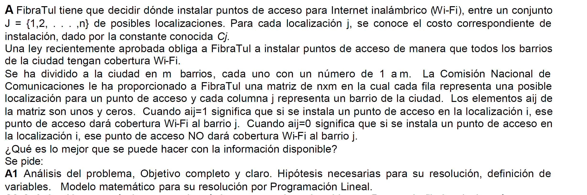
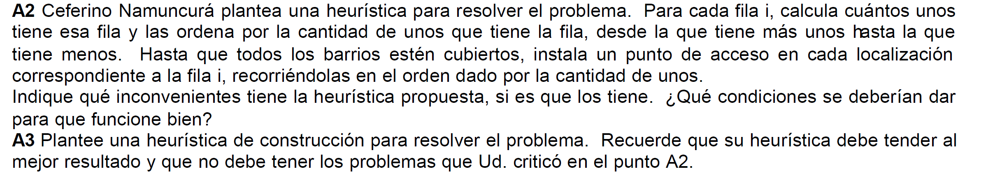

# Examen Final 
## 3/2/10

@deadpulTeam

### Modelo de programación lineal
#### Enunciado

  

#### Análisis de la situación problemática :point_left:

Es un problema de **cobertura de conjuntos**. Se debe distribuir puntos de acceso para que **todos** los barrios de una ciudad tenga cobertura WIFI.  

Posibles localizaciones para los puntos de acceso: 
$$
I = {1,2,...,n} 
$$

Se conoce el costo por instalación de posible punto de acceso. 

Existen m barrios:
$$
J = {1,2,... m}
$$

Tenemos una matriz que nos dice por cada localización cuantos barrios cubrimos :) 

#### Objetivo :innocent:

Determinar dónde y cuántos puntos de acceso hay que colocar para proveer de wifi a todos los barrios de la ciudad, en un periodo de tiempo determinado para minimizar el costo de instalación de posible localización. 

#### Hipótesis y supuestos :sweat_smile:

- Todos las localizaciones son accesibles para instalar los puntos de acesso. 
- No hay gastos adicionales a los mencionados. 
- Los precios no varían. No hay inflación 
- Alguien se encarga de la correcta instalación. 
- Las instalaciones no fallan. 
- Se permite el **solapamiento** de la señales para un mismo barrio. No conduce a fallas en el sistema. 
- Los tiempo de instalación son despreciables. 
- No hay otra forma de proveer wifi si no es porque se cumple la relación $A_{i,j}$.

#### Constantes :see_no_evil:

- $C_i$: costo de la instalación i $\forall i \in I$
- $A_{i,j}$: vale 1 si el barrio j es alimentado por la instalación i de wifi. $\forall i \in I$ $\forall j \in J$

#### Variables 

- $Y_i$: (*bivalente*) vale 1 si se instala un punto de acceso en la locación i ó 0 sino. $\forall i \in I$

#### Modelo de programación lineal :skull:

Cobertura de conjuntos:
$$
\forall j \in J \ \  \sum_{i \in I}  A_{i,j} Y_i \ge 1
$$

Funcional: 

$$
Z = \sum_{i\in I} C_i Y_i  \to min
$$

### Heurística 

  

#### Críticas 

- No tiene una heurísitca de desempate. 
- No minimiza el objetivo (costo de instalación)
- No reorganiza la tabla cada vez que toma elije una locación para eliminar los barrios que ya fueron agregados. 

#### Nueva heurística

1. Calcular cuantos unos tiene cada fila  
2. Mientras haya barrios sin cubrir:
    a. Ordenar en una lista descendiente las locaciones según: 

    $$
    \frac{\#CantBarriosSinCubrir}{CostoDeInstalación}
    $$
    b. Si hay un empate tomar el que abarca más barrios. Si hay un empate nuevamente, elegir el más barato. Y sino le preguntas a **tu vieja** cual locación quiere. :skull:
    c. Tomar la primera locación y marcar los barrios como cubiertos. 

