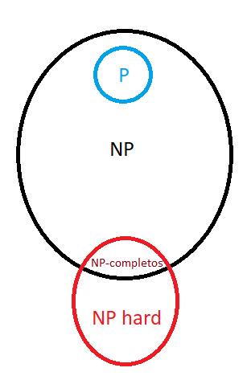
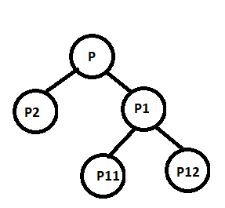

# Modelos y optimización 1
#### Resumen/Ejemplos/Respuestas 

Magali Marijuán
*Un desesperado intento de aprobar una materia tan indeseable para mí. No es difícil, es cuestión de práctica, suerte y lágrimas.* :unamused::cry::four_leaf_clover: Si esto se filtra en la comunidad FIUBA: usalo para el final, sino, te spoileas y no aprendes. 

### Temas

- ¿Cómo plantear un problema? 
    - Análisis de la situación problematica. Objetivo. Hipotesis y supuestos clásicos. 
    - Trucos con restricciones. 
    - Problema de mezcla. Consideraciones. 
    - Problema de armado. Consideraciones
    - Problema de centros. Consideraciones. 
    - Problemas con restricciones financieras. 
    - Problemas con varios periodos (stock). 
    - Problemas con un modelo geométrico :fearful::scream:
- Clasificación de problemas
    - Complejidad algorítmica. Algoritmos de resolución de problemas no enteros. Heurística.
    - Cuestionario semana 14 
    - Cuestionario semana 15
    - Cuestionario semana 18
- Problemas combinatorios
    - Problema del viajante: 
        - Variables y restricciones. Variantes. 
        - Heuríticas para resolverlo 
        - Custionario de la semana 8
        - Cuestionario semana 16
    - Problema de la mochila
        - Variables y restricciones. Variantes.
        - Heurísticas. 
        - Relajación lineal
        - Cuestionario de la semana 10
        - Cuestionario semana 17
    - Problema de coloreo de grafos
        - Variables y restricciones. Variantes. 
        - Relajación lineal
        - Cuestionario de la semana 10
        - Cuestionario semana 17
    - Problema de distribución
        - Variables y restricciones. Variantes.
            - el problema del transbordo
            - el problema de asignación
        - Relajación lineal. 
        - Cuestionario de la semana 7
    - Problema de asignación cuadrática
        - Variables y restricciones. Variantes.
    - Problema de cobertura de conjuntos
        - Variables y restricciones. Variantes.
        - Cuestionario de la semana 9
    - Scheduling
        - Variables y restricciones. Variantes. 
        - Cuestionario de la semana 9
    

(podría agregar un ejemplo de un parcial viejo de cada tipo :skull:)

- SIMPLEX
    - Características generales
    - ¿Cómo saber si llegamos al óptimo?
    - ¿Quién sale de la base?
    - Pasos para cambiar de base 
    - Casos partículares
    - Problema dual (teoremas)
    - Análisis de sensiblidad

(podría agregar un par de ejemplos de parciales viejos :skull:)
    
### ¿Cómo plantear un problema? 

En el **análisis de la situación problemática** hay que decir qué tipo de problema es o a cual se parece. Puede ser más de uno. 

Ejemplos: Es un proceso productivo/ el un problema de planificación de la producción / es un problema de armado / es un problema de mezcla con restricciones financieras, etc.

En el **objetivo** se debe mantener la estructura: **qué** se quiere determinar, **para qué** se quiere determinar eso, **en qué** periodo de tiempo. 

**Hipótesis y supuestos clásicos**

*Usar cuando tengan sentido y cuando el enunciado no especifique o NO DIGA LO CONTRARIO* :stuck_out_tongue_winking_eye:

- Todo lo que se produce se vende.
- Los recursos no mencionados no son limitantes.
- No hay inflación ni varian los precios (costos o ganancias o ambos). 
- No hay desperdicios de matarial. 
- No hay tiempos muertos en la producción. 
- (*Hipótesis de certeza*) Alguien se encarga de controlar el proceso productivo. 
- (*Hipótesis de certeza*) Las máquinas no fallan. 
- (*Hipótesis de proporcionalidad*) El consumo de los recursos es proporcional a la cantidad fabricada. 
- (*Hipótesis de divisibilidad*) Se pueden fabricar cantidades arbirariamente pequeñas. 
- (*Hipótesis de aditividad, para mezcla.*) Se pueden mezclar sin que cambie la cantidad total obtenida. Los elementos no reaccioan entre sí. 
- (*Para problemas de mezcla*) no importa qu pequeña sea la porión que se toma de cada mezcla, siempre se tiene la misma proporción de componente. 
- (*Para problemas con stock*) Los productos almacenados no pierden sus propiedades ni se deterioran. 
- (*Para problemas de stock*) Es posible que se deba determinar si el stock puede ser infinito y si hay o no costos de almacenamiento. 
- (*Para problemas de stock*) No hay stock final o inicial. 
- (*Para problemas de stock*) Diría que un producto se puede almacenar por varios periodos. Nos ahorramos un par de problemas, ¡qué trucazo! :wink:
- Las demandas son exactas / máximas / mínimas, eligiría en función de lo que mejore el funcional. 
- (*Para problemas con restricciones financieras*) El costo de las compras debe estar cubierto con la caja inicial o no :pensive:
- (*Para problemas con restricciones financieras*) Los intereses se cobran/pagan por adelantado/vencidos. 
- (*Para problemas con restricciones financieras*) La devolusión del préstamo y la extracción del depósito están fuera del modelo. 
- (*Para problemas con restricciones financieras*) Se puede depositar o extraer la cantidad de dinero que se desee. 
- (*Para problemas del viajante*) **Casi seguro que tienen que estar todas** 
    - Todos los caminos están disponibles en ambos sentidos
    - Todos los caminos pueden visitarse en cualquier momento 
    - No hay contratiempos en el camino
    - Cada región se visita una sóla vez. 
- (*Para problemas de centro*): determinar si la pérdida se contabiliza a la entrada o a la salida del centro. SI es que hay perdida, seguro sí. 

### Trucos con restricciones

Todas las $Y_i$ son bivalentes, las $E_i$ enteras y las $C_i$ continuas.

- Anular variables :skull:

:warning: **Controlar siempre no anular una variable que dependa de la que anulamos, porque si no podemos tener un problema incompatible. A veces es mejor anular restricciones.**

$$
m Y_i \le X_i \le M Y_i
$$

Si por ejemplo X repesenta la cantidad que vendemos de un producto y definimos: 

$$
0.28 CantProdExtraído = X_i
$$

Y decidimos no vender, y anulamos la variable $X_i$, estamos anulando la cantidad extraida de producto. 

- Or

$$
Y_{or} \le  \sum_n Y_i \le n Y_{or}
$$

- And

$$
n Y_{and} \le  \sum_n Y_i \le n - 1  + Y_{and}
$$

- Anular restricciones :point_left:

$$
X_i  \le 3 + M Y_{res}
$$

- Costo diferencial por intervalo

Queremos sabér en qué intervalo se encuentra C: 

$$
C = C_1 + C_2 + C_3
$$

$$
Y_1 \le C_1 \le 30 Y_1
$$

$$
31 Y_2 \le C_2 \le 60 Y_2
$$

$$
61 Y_3 \le C_3 \le M Y_3
$$

- Función cóncava seccionalmente lineal 

Queremos que las primeras 10 unidades de C valgan 10, las proximas 7, 9 y las restantes 4. El problema es de máximización: 

$$
C = C_1 + C_2 + C_3
$$

$$
10 Y_2 \le C_1 \le 10
$$

$$
7 Y_3 \le C_2 \le 7 Y_2
$$

$$
C_3 \le M Y_3
$$

- Que una bivalente valga uno si una entera vale 11

$$
11 - E = EXC - DEF
$$

$$
m Y_{exc} \le EXC \le M Y_{exc}
$$

$$
m Y_{def} \le DEF \le M Y_{def}
$$

$$
Y_{exc} + Y_{def} + Y_{iguales} = 1
$$

- Que dos bivalentes sean distintas. 

$$
Y_1 + Y_2 = 1
$$

- Que una entera tome ciertos valores

Si queremos que tome valor 3, 9 o 10, 

$$
3 Y_3 + 9 Y_9 + 10 Y_10 \le E 3 \le Y_3 + 9 Y_9 + 10 Y_10
$$

$$
Y_3 + Y_9 + Y_{10} = 1
$$

- Que una entera tome cierto valores en rangos. 

Por ejemplo, que tome valores 1,2,3 o 5, 6, 7: 

$$
5 Y_1 + 1 (1 - Y_1) \le E \le 7 Y_1 + 3 (1 - Y_1)
$$

- Que una entera tome el mayor valor entre otras enteras

$$
E \ge E_1
$$

$$
E \ge E_2
$$

$$
E \ge E_3
$$

$$
E \le E_1 + M (1-Y_1)
$$

$$
E \le E_2 + M (1-Y_2)
$$

$$
E \le E_3 + M (1-Y_3)
$$

$$
Y_1 + Y_2 + Y_3 = 1
$$

- Que una continua tome el segundo mayor valor entre otras enteras. 

$$
C_1 - Y_1 M \le C \le C_1 + Y_5 M
$$

$$
C_2 - Y_2 M \le C \le C_2 + Y_6 M
$$

$$
C_3 - Y_3 M \le C \le C_3 + Y_7 M
$$

$$
C_4 - Y_4 M \le C \le C_4 + Y_8 M
$$

$$
Y_1 + Y_2 + Y_3 + Y_4 = 2
$$

$$
Y_5 + Y_6 + Y_7 + Y_8 = 1
$$

### Problema de mezcla. Consideraciones.

Es importante tener en cuenta que puede **no usarse todo lo extraído u obtenido en la mezcla**, para evitar problemas incompatibles. 

### Problema de armado. Consideraciones

Es importante hacer una apertura de variables para los recursos que se comparten en las distintas cosas que se arman. Si no, estaríamos usando un recurso para dos cosas. 

### Problema de centros. Consideraciones. 

No se qué poner :(

### Problemas con restricciones financieras.

Siempre es importante considerar si los intereses son: 
- **Vencidos:** NO son ingresos o egresos de caja. 
- **Por adelantado:** SI son ingresos o egresos de caja. 

La restricción clásica es la siguiente: 

(CAJA_INICIAL + ingresos - egresos) - NIVEL_A_ALCANZAR = exc - def

Los intereses se calculan en función de ese exceso o defecto. Y los ingresos o egresos incluyen esos intereses según lo que mencioné antes. 

### Problemas con varios periodos (stock)

Lo que hacemos es dejar stock de un periodo a otro. 

$$
\forall \ i \in periodos \to Ventas(i) + Stock_f (i) = P(i) + Stock_f(i-1)
$$

### Problemas con un modelo geométrico :fearful::scream:

Esto es para el caso en el que un porcentaje de la producción pase de una fase a la siguiente (ponele, si hiciste un ejercicio de esto me entendes ;) ) 

Suponete que la cantidad de productos es X y pasan a la siguiente fase el 90% (son dos fases de procesamiento). Y queres saber cuantos se procesan en la fase uno para contabizar costos. ¿Cómo saber cuantos se procesaron?

De los X originales 0,1 vuelven a procesarse, de esos el 0.1, de esos el 0.1 ... 

$$((((0.1 X)0.1)0.1) ...) = 0.1^n X = X \frac{1}{1-0.1}$$ 

:hankey:

## Clasificación de problemas

Problemas difíciles (hard): se analizan según la complejidad. 

Problema del tipo **P**: la relación entre el tamaño del problema y el tiempo de ejecución es polinómica. Los O(n) o O(1)

Problema del tipo **NP**: se resuelven en tiempo polinomico por una máquina no determinista. Cosoto factoriales o exponenciales en máquinas deterministas (las que conocemos por ahora). Se requieren una cantidad significativa de recursos computacionales. Generalmente se resuelven mediante **heurísticas**. Los O($n^{algo}$) O(n!) O($algo^n$)

**Teorema de reducción**: si un problema NP puede resolverse como P, entonces, no es difícil. 

**Diagrama de problemas:**

  

Para resolver un problema: 

Cuando no sabemos como es el problema:
- Escribimos las restricciones, ¿Es lineal?
    - Sí, entonces resolvermos por Simplex
    - No, resolvemos la **relajación lineal** ¿Da entero?
        - Sí, entonces es la solución óptima
        - No, entonces: 
            - Planteamos un heurísitca 
            - Planteamos algún algoritmo que nos perimita obtener la **cápsula convexa entera de soluciones**.

Por lo tanto, algunas definiciones para tratar con problemas enteros o mixtos:

**Relajación lineal** cuando se resuelve un problema entero como si fuera lineal. Más adelante veremos qué nos dice la relajación lineal de cada tipo de problema clásico. 

**Capsula convexa o poliedro entero**: poliedro más chico que cotiene a las soluciones enteras (en sus vértices).

**Desigualdad válida**: aquella que cumplen todos los puntos del poliedro entero. 

**Cara**: desigualdad válida cuya intersección con el poliedro no es vacía. Contiene algún punto del poliedro. 

**Faceta**: desigualdad válida cuya intersección con el poliedro tiene dimensión igual a la del poliedro menos 1. 

**Plano de corte**:

- Características:
    - Desigualdad válida. 
    - No es parte de la formulación actual. 
    - No es satisfecha por la solución ótima o relajación lineal actual. 
    - Tiene un algoritmo para encontralo. 

- Pueden ser del tipo: 
    - Gomory. 
    - Cover. 
    - Lifteados. 
    - Desigualdades válidas de conjuntos independiente. 

### Algoritmos para resolver problemas enteros

Para saber qué algoritmo usar se debe definir qué tipo de problema es: 

-  Problema entero con todas variables bivalentes:
    - Fuerza bruta o métodos enumerativos
    - Métodos pseudo-booleanos: convertir el modelo en un conjuto de expresiones del algebra de boole. 

- Cuando las variables son enteras o el problema es mixto: 
    - Método de planos cortantes. 
    - Branch and Bound

**Branch and bound**

Dado el problema original **P**: 
- Cada nodo corresponde a un subproblema. 
- Obtenemos el óptimo de cada nodo (cota del problema), mediante la relajación lineal. 
- Si la cota es peor que la mejor solución obtenida hasta el momento, entonces, no analizar esa rama.

  

- **Poda**: se poda la rama en el que: 
    - la solución no es factible 
    - subproblema con función objetivo menor a la solución factible previa (siempre que agreguemos restricciones el funcional empeora)
    - Ya se obtuvo solución entera.

- **Branching** Consiste en dividir en dos el poliedro con el que se está trabajando, eliminando la parte en el cual está el ótimo continuo. Veremos si alguno de estos dos problemas dio entero. Esto es, por ejemplo:

Si obtuviste para $X_1 = 3.5$ entonces abrí dos ramas cada una con alguna de estas restricciones: 
- $X_1 \le 3$ 
- $X_1 \ge 4$ 
.
- **Bounding** Cuando obtenemos una solución factible con todas las variables del problema. (Esto es no dividimos más esa rama).

En conclusión: por cada nodo, con los dos problemas, obtenidos en branching, si ninguno de llos dos es una solución factible con todas las variables enteras y ninguno es incompatible, vamos a elegir para seguir subdividiendo el de mayor funcional y el otro lo dejaremos en  suspenso, hasta que hayamos agotado la rama que vamos a explotar, luego volveremos y vemos si vale la pena analizar la rama en suspenso. 

### Heurísticas

Las heurísticas se clasifican en:
- de construcción
    - con garantía de calidad: establece una relación entre la solución que se puede obtener con la heurística y a solución óptima del problema. 
    - sin garantía de calidad
- de mejoramiento

### Preguntas de la semana 14:

El método de Branch and bound resuelve cada problema o sub-problema:

- Como si todas las varibles enteras fueran  continuas y luego verfica si dieron valor entero. *SI. si todas las varaiables enteras dieron entero, es una solución entera válida y termina de explorar esa rama.* 
- Obligando a que las variables enteras tomen valor entero en la resolución del problema o sub-problema.*NO, porque resuelve la relajación lineal.* 
- Haciendo que algunas de las variables enteras tengan que tomar algún valor entero y otras no. *NO, busca la solución entera del problema.*

Los planos de corte:

- Se usan para resolver problemas de programación lineal entera. *SI, se obtienen a partir de  algoritmos*.
- Sirven para resolver problemas de programación lineal continua. *NO, para que usaría un algoritmo extravagante y agregar restricciones empeorando el funcional, si puedo usar simplex.*

Los cortes tipo Gomory:

- Son cortes para un problema específico de problema. *NO, como sí lo són los cover o los lifteados que son para problemas tipo mochila*
- son planos de corte de tipo general. *SÍ*

### Preguntas de la semana 15

Las heurísticas se utilizan para resolver problemas: 
- de programaición lineal continua. *NO, NADA LE GANA A SIMPLEX POR ESO HAY 53 MILLONES DE UNIDADES DEL TEMA*.
- de programación lineal entera y optiización combinatoria: *SI. Siempre que el problema requiera de mucha computación :unicorn:*

El hecho de que un algoritmo heurístico dé un buen resultado para un determinado problema: 
- depende de los datos que tiene el problema determinado. *SI. Como pasa en el caso de la mochila o del viajante. Ver Heuríticas*
- es independiente de los datos del problema. 

EN los problemas de Job-shop scheduling:
- la secuencia de las tareas no es la misma para todas las tareas. *SI. No le di mucha bola a este tema todavía.*
-la secuencia de las tareas es la misma para todas las tareas.

### Preguntas de la semana 18 

Se dice que un probema es de "clase P" respecto a su complejidad...

- cuando existe un algoritmo de clase P que lo resuelve. *SI. Si exite un algoritmo que lo resuelve en tiempo polinómico en relación a los datos de entrada*.
- cuando algunas instancias se pueden resolver en tiempo polinómico. *NO, ¿qué son las instancias?*
- cuando se necesita una máquina de Turing No determinística para resolverlo. *NO, en este caso sería NP*

La complejidad se puede definir como la relación... 
- entre la cantidad de variables del problema y la cantidad de restricciones del mismo. *NO. En todo caso, sería la cantidad y el TIPO de las variables, Si las variables son todas continuas, puede resolverse por SIMPLEX. Si las variables son enteras, entonces el problema podría ser más complejo. Y siempre hay que considerar como escala el problema en función de los datos de entrada.*.
- entre el tiempo que se tarda en resolver un problema  el tiempo promedio de resolución de ese tipo de problemas. *NO, ¿qué sería el tiempo promedio?*
- entre la cantidad de instrucciones computadas y el tamaño de la instancia. *SI. Si el problema escala exponencial o factorial, la cantidad de instrucciones aumentan considerablemente al aumentar la instancia. Y vice versa.*

Un problema B "no es más fácil" que un problema A:

- si A puede convertirse en B en tiempo polinomial. *SI. Si tenemos dos problemas diferentes, para determinar si un problema es más dificil que otro podríamos aplicar **reducción** de esta forma si es posible convertir un problema A en otro problema B entonces B no es más fácil que A sino que estarían los dos agrupados en el mismo nivel de dificultad. Si no es posible transformar uno en el otro, entonces uno es más difícil.*
- si A es igual a B. *NO, por lo dicho antes*
- si A puede convertirse en B en un tiempo no polinomial. *NO, por lo dicho antes*

## Problemas combinatorios

### Problema del Viajante

#### ¿Cómo es el problema?
- Un viajante tiene que partir de su casa y visitar una serie de clientes antes de retornar finalmente a su casa.
- No se puede dejar de visitar a ningún cliente. 
- Se conocen las distancias entre cada par de clientes y entre cada cliente y la casa del viajante. 

*Los items de arriba pueden/deben ser supuestos*

**Restricciones, variables y constantes**

$\forall i, j \in$ CIUDADES

Constantes: 
- $C_{i,j}$ distancia entre el lugar i al j.

Variables: 
- $Y_{i,j}$: el viajante va de la ciudad i a la j directamente 

Restricciones: 

*De un i se va a un solo j*:
$$ 
\sum_{j \in ciudades \ \ i \ne j}  Y_{i,j} = 1 \ \ \forall i \in CIUDADES 
$$

*De un j se viene de un solo i*: 
$$ 
\sum_{i \in ciudades \ \ i \ne j}  Y_{i,j} = 1 \ \ \forall j \in CIUDADES 
$$

*Funcional, minimizamos el costo*
$$
Z = \sum_{i \in ciudades} \sum_{j \in ciudades} Y_i,j\ C_{i,j}
$$

*Evitar subtours*
Para evitar subtours hay dos maneras: 
- MTZ (Miller, Kuhn y Tucker):

$U_i$: número de secuencia en la cual la ciudad i es visitada. $\forall i\ CIUDADES$

$n = \#CIUDADES $

$$
U_i - U_j + n\ Y_{i,j} \le n-1 \forall i, j \in \{CIUDADES - origen\}
$$

**Spoiler alert**: Las variables $U_i$ toman valor entero auque sean definidas como continuas. 

Si visito i justo antes de j, entonces $Y_{i,j} = 1 $ y, y por lo tanto, el número de orden de i debe ser menor que el de j para que se cumpla con la restricción. 
Si no visito i justo antes de j, entonces el número de orden de i y el número de orden de j pueden ser cualquiera. 

Es importante no incluir el origen, porque si no nunca se va a cerrar el circuito. Queremos que sea un arco abierto lo que no incluye al origen. 

- Restricciones que evitan subtours o método de eliminación de subtours: 

Otra manera es agregar restricciones que evitan subtours. Por ejemplo, si las ciudades se numeran con números del 1 al cuatro, debemos plantear todas las combinaciones de subtours con 4 ciudades, de los distintos tamaños posibles (2,3,4). No las voy a escribir porque es engorroso. 

¿Para qué sirve esto? En ambos métodos es impráctica la cantidad de restricciones para problemas grandes, con este segundo método, se puede resolver la **relajación lineal** y luego agregar las restricciones que eviten los subtours en los casos en los cuales se arman subtours y no en otros. 

**Variaciones**
El problema del viajante puede ser:
*Es importante definir supuestos o hipótesis*
- Simétrico, si la distancia entre dos nodos es igual en ambos sentidos. 
- Anti simetrico, si no lo es. 
- Puede haber dos o varios caminos entre dos nodos. 
- Problema de orden.  Cuando se necesita restringir el orden de visita, es importante definir la $U_i$.
- Varios viajantes :skull: 

#### Heurísticas

Para el viajante existen las siguientes Heurísticas:

- Vecino más próximo: 

1. Se empieza con un tour parcial trivial que contiene una sola ciudad. (heu para elegir origen) 
2. Mientras queden ciudades sin agregar al tour:
    a. la proxima ciudad elegida es la más cercana a la última del tour siempre que no esté ya incluída en el tour. (heu para desempate)
3. Fin mientras:
    a. cuando todas las ciudades están en el tour se conecta la última con el origen. 

- Emparchamiento más cercano

1. Elergir eje con menor costo. (heu para desempate)
2. mientras queden ciudades sin agregar al tour:
    - ir elegiendo de los ejes restantes el que tenga menor costo y nos permita seguir agregando cuidades (el eje se agrega en cualquiera de los extremos).
3. Fin: se agrega el eje que permita unir las ciudades que hayan quedado desconectadas.

- Heurística de inserción más cercana

1. Comenzar con un subtour de una sola ciudad. 
2. Mientras queden ciudades sin agregar al tour:
    a. la proxima ciudad a agregar (que aún no haya sido visitada) es la que permita armar un nuevo subtour, con una ciudad más al menor costo posible. Para cada candidata a agregar se calcula la diferencia de costo entre el tour anterior y el obtenido con el agregado de esta nueva ciudad. 

Esas son las más sencillas, luego estan:
- Heurística del arbol generador mínimo. 
- Heurística de barrido.
- Heurística de curavs de Sierpinski. 

Heurísticas de mejoramiento: 
- K intercambios.

#### Cuestionario de la semana 8

Las variables $Y_{i,j}$ del problema del viajante: 
- Indican si una ciudad del viajante es visitada o no. *NO*
- Indican qué tramos del grafo serán parte del tour del vaijante. *SI, o más fácil, si se va de í a j directamente.*
- Indican el número de orden en que la ciudad es visitada. 

Las variables $U_i$ del problema del viajante MTZ van tomando valor a medida que el viajante va pasando por las ciudades (V o F):

Falso, si bien toman el número de orden, no lo hacen **a medida que el viajante va pasando**, el modelo busca todas las soluciones posibles y se fija cuál cumple con todas las restricciones, definiendo el número de órden. Siempre son n! caminos posibles.  Es importante recalcar que estas variables, NO INCLUYEN AL ORIGEN. 

SI agregamos enb el problema estandar del viajante que una ciudad D determinada puede o no visitarse según lo leiga el modelo. $Y_D$, nos determina si se visita o no la ciudad D. 
- hay que eliminar la UD. *NO. ¿por qué? si la visito quiero saber el órden o que no se armen subtours con esta ciudad.*
- hay que igualar las restricciones de sumantoria $Y_{i,j}$ variando j cuando i es D y de sumatoria de $Y_{i,j}$ variando j cuando i es D a YD. *SI, sería algo así:*
 
$$ 
\sum_{i \in ciudades \ \ i \ne j}  Y_{i,j} = Y_D \ \ \ j = D 
$$

$$ 
\sum_{j \in ciudades \ \ i \ne j}  Y_{i,j} = Y_D \ \ \ j = D 
$$

- hay que igualar las restricciones de sumatoria de $Y_{i,j}$ variando j cuando i es D y de sumatoria de $Y_{i,j}$ variando j cuando i es D a cero. *NO, ni idea que quiere decir con esto pero no..*

#### Cuestionario de la semana 16

La cantidad de soluciones posibles para un problema del viajante es:
- (n+1)! siendo n el número de ciudades a visitar y se le agrega 1 por el origen. 
- n! siendo n el número de ciudades a visitar. *SI, es esta. Voy al primer nodo, sea cual sea, tengo n-1 ciuades que puedo visitar, voy al segundo nodo, sea cual sea, tengo n-2 ciudades por visitar... etc. ¿Se ve el factorial? :)*.
- n (n-1) siendo n el número de ciudades a visitar. 

La heurística dle vecino más cercano: 
- cada paso de la iteración parte de la última visitada. *SI*.
- cada paso parte del origin del viajante. *NO, no tendría sentido, sería un asterisco y no un circuito :skull:*
- no necesariamente cada paso comienza en la ciudad donde terminó la visitada. *NO, si nó no sería un circuito sin subtours*.

En la heurística de inserción más cercana: 
- no se ciera el tour. *NO, se arma un tour de 1, dsp se agrega otro nodo y ser arma un tour de 2, se agrega otro nodo y se arma un tour de tres, se agrega el tercero donde más convenga, etc.*
- se cierra el tour en cada paso. *SI, es lo que dije arriba.*
- se cierra el tour cuando ya se hay visitados todas las ciudades. *NO, eso es en vecino más cerano o emparchamiento más cercano.*

Las heurísticas de 2-intercambio: 
- quitan del tour dos tramos consecutivos y los reemplaza por otros dos tramos distintos. 
- quitan del tour dos tramos no consecutivos y los reemplazan por otros dos tramos distintos. *ES ESTA.*

### Problema de la mochila

#### ¿Cómo es el problema?

Hay una persona que tiene una mochila con una cierta capaciad y tiene que elegir qué elementos podnrá en ella. Cada uno de los elementos tiene un peso y aporta un beneficio. El objetivo es elegir los elementos que le permitan maximizar el beneficio sin excederse de la capacidad permitida. 

**Restricciones, variables y constantes**

Constantes: 
- c: capacidad de la mochila
- $p_i$ beneficio unitario por ingresar el producto i en la mochila. 
- $w_i$ peso del producto i. 
- n: cantidad de productos.

Varaiable: 
- $x_i$: el producto i se guarda en la mochila. Bivalente. 

Restricciones: 

$$
\sum_{i = 1}^n w_i \ \ x_i \le c
$$

$$
z = \sum_{i = 1}^n p_i \ \ x_i \to max
$$

**Variaciones**

*(Para estas variaciones estaría bueno suponerlo o agregar hipótesis en el modelo que estemos haciendo).*

- El anterior era no acotado. 

- Acotado. Se cuenta con una cantidad limitada y conocida de cada una de los elementos. 

    Constantes (agregadas):
    - $b_i$: cantidad disponible del elemento i. 

    Variables:
    - $x_i$ no es binaria si no entera. 

    Restricciones (agregada):
    $$x_i \le b_i$$

- Problema de subconjuntos. El beneficio ees igual al peso para cada uno de los elementos. 

- Problema del cambio. Se quiere cumplir exactamente con la restricción de capacidad. 

- Multiples mochilas. 

    Constantes (agregado): 
    - m: cantidad de mochilas.
    - $c_j$: capacidad de la mochila j. 

    Variables:
    - $x_{i,j}$ vale uno si el elemento i se guarda en la mochila j. 

    Restricciones: 

    Para asegurarnos de guardar cada elemento en una sóla mochila. 
$$
\sum_{j=1}^m x_{i,j} = 1 \ \  \forall i
$$
$$
\sum_{i = 1}^n w_i \ \ x_{i,j} \le c_j \ \ \forall j
$$
$$
z = \sum_{j = 1 }^m \sum_{i = 1}^n p_i \ \ x_{i,j} \to max
$$

#### Heurísticas

Dado el modelo no acotado. 

- Aproximación a través del coeficiente de rendimiento: 
    - Ordenar los productos en forma descendente según la proporción. 
    $$ r_i = \frac{p_i}{w_i}$$
    - meter los elementos de esta list a ordenada hasta que nose pueda ingresar el elemenoto siguiente a la mochila. 

- Mejoramiento a través de la comparación con el elemento crítico: 

El elemento crítico, es el primer elemento que, en caso de incluirlo, se excede la capacidad permitida. La heurística se puede mejorar agregando un paso posterior que consiste en comparar el resultado obtnenido con el beneficio del elemento crítico. 
 

Es importante destacar que la **relajación lineal del problema** nos da una cota. Nos da el resultado óptimo + un porcentaje del elemento crítico. 

#### Cuestionario de la semana 10

En el problema de la mochila si tenemos varios objetos de cada tipo y hay múltiples mochilas, qué significan las variables principales del problema: 
- $x_{i,j}$ vale 1 si el objeto i va en la mochila j. *NO. Porque hay varios objetos de cada tipo*.
- $x_{i,j}$ variable entera qu emide la cantidad de objetos del tipo i que van en la mochila j. *SI*
- $x_{j}$ variable entera que mide la cantidad de objetos que van en la mochila j. *NO...*

En el caso anterior del problema de la mochila ¿cuántas restricciones de capacidad habra?
- Una por cada mochila y una por cada tipo de objeto. 

#### Cuestionario de la semana 17

Cuando se resuelve la relajación lineal (resolver mediante el modelo como si todas la variables fueran continuas) de problema de la mochila:
- el resultado da siempre que todos los objetos entran en la mochila. *NO*.
- el resultado obtenido sirve como cota de la resolución. *SI, lo explico más arriba*.
- el resultado no tiene relación con la mochila óptima. *NO*

El elemento crítico de las heurísticas de la mochila: 
- es el último elemento que entra. *NO. Justamente, es el que no entra o entra parcial.*
- es el siguiente elemento despues del primero que no entra. *NO*
- es el primer elemento que no entra en la mochila. *SI*

### Problema de coloreo de grafos

#### ¿Cómo es el problema?

Dos vértices adyacentes de un grafo no pueden ser coloreados con el mismo color. Sabemos que si el grafo es planar, entonces, se pueden usar 4 colores. 

**Restricciones, variables y constantes**

Constantes:
- n: cantidad de colores posibles. 

Variables: 
- $x_{i,j}$: el vértice í se colorea con el color j. Bivalente.
- $w_j$: se usa el color j. Bivalente

Restricciones: 

Cada vértice se pinta de un solo color:
$$
\sum_{j = 1}^n x_{i,j} = 1 \ \ \forall i \in vertices
$$

Dos vértices adyacentes se pintan de colores distintos:
$$
x_{i,j} + x_{k,j} \le w_j \ \ \forall [i,k] adyacentes
$$

Funcional, minimzar la cantidad de colores.89 
$$
Z = \sum_{j = 1}^n w_j 
$$

Para eliminar la simetría: 

El color se activa si algún vértice lo utiliza: 
$$
w_j \le \sum_{i\in V} \ \  \forall j = 1, ..., n
$$

Usar los j en orden, o sea, no saltear colores:
$$
w_j \ge w_{j+1} \ \  \forall j = 1, ..., n-1
$$

#### Heurísticas

La **relajación lineal** siempre da que **cada nodo debe ser pintado de dos colores**. Además sabemos que el problema de la mochila es dificil porque tiene $2^n$ posibles soluciones. Se usa o no el color j. 

Para resolver este problema existe: 

- Heurísticas golosas (greedy):
    - son rápidas
    - no suelen tener buenos resultados
    - se usan para crear soluciones iniciales de metaheurísticas más complejas
    - ejemplos:
        - larges saturation degree
        - recursive larges first

Ejemplo: 

i = 1

mientra el grafo no esté coloreado:
    - elegir un color $c_i$
    - colorear todos los vértices que se puede con c_i a partir de un vértice arbitrario
    - i = i+1

**En las heurísticas greedy el órden en el cual se van recorriendo los nodos es decisivo.**

#### Cuestionario de la semana 10

En el problema de coloreo de grafos ¿cómo podemos definir el problema de simetría en la solución óptima?:

La respuesta es a): se produce cuando tenems varias soluciones óptimas que usan la misma cantidad de colores pero pintan los nodos de distinta forma (cada una con al menos una diferencia de color en algún nodo respecto de las otras).

#### Cuestionario de la semana 17

Cuando se resuelve la relajación lineal del problema de coloreo de grafos:

- da una cantidad mayor de colores que el óptimo. *NO. No tiene sentido si puedo pintar parcialmente un nodo de un color*
- siempre da que se necesitan 4 colores. *NO. Esto es el resultado de los grafos planares, pero demostrar que un grafo es planar, es difícil*
- el resultado es que siempre se necesitan solamente dos colores para colorear. *SI*.

### Problema de distribución o transporte

#### ¿Cómo es el problema?

Tenemos: 
- Un conjunto de lugares, cada uno de los cuales tiene dispoinible una cantidad de unidades de un producto: *orígenes o suministros*
- Un conjunto de lugares cada uno de los cuales demanda una cantidad de unidades de un producto: **destino o demandas**.
- Se conoce el costo $C_{i,j}$ de enviar una unidad desde el origen i hasta el destino j. 

Supuestos: 
- Cualquier origen puede enviar producto a cualquiera de los destinos
- **Producto homogéneo** (estamos hablando del mismo producto en orígenes y destinos)
- Costos lineales.

La demanda total tiene que ser igual a la oferta total, si no fuera así habria que agergar un origine ficticio (demanda > oferta) o un destino ficticio (oferta > demanda).  Los costos de estos son muy grandes o muy chicos intentando que el modelo no los elija como primera opción. 

**Restricciones, variables y constantes**

$i \in ORIGENES$
$j \in DESTINOS$

Constantes: 
- $C_{i,j}$: costo de enviar una unidad de la ciudad i a la j.
- $O_{i}$: oferta de la ciudad i
- $D_{j}$: demanda de la ciudad j

Variables (enteras):
- $X_{i,j}$: cantidad de unidades que se envian de i a a j.

Restricciones:

Por cada origen hay que asegurar que se van a distribuir todas las unidades. 

$$
\sum_{j \in dDESTINOS} X_{i,j} = O_{i} \forall i
$$

Por cada destino hay que asegurar que le van a llegar todas las unidades. 

$$
\sum_{i \in VERTICES} X_{i,j} = D_{j} \forall j
$$

Funcional

$$
Z = \sum_{i}\sum_{j} C_{i,j} X_{i,j} \to MIN
$$

**TEOREMA**: si todas las ofertas y todas las demandas **son números enteros** siendo todas las reestricciones **igualdades**, el problema de distribución o transporte tendrá como resultado que todas las variables tomarán valor entero auqnue no se les ponga la condición de que las variables tienen que tomar valor entero. Es muy importante que la oferta total sea igual a la demanda total. 

**Variaciones**

- **El problema del transbordo**: en este problema las unidades no son enviadas directamente desde los origenes hacia los detinos, sino que las unidades van desde los orígenes hasta alguno de los centros de transbordo y desde éste a alguno de los destinos. 

Hacemos una apertura de variables y planteamos lo mismo que arriba:

Nuevas variables: 
- $XO_iT_j$: cantidad de unidades qeu van del origen i al transborde j
- $XT_jD_k$: cantidad de unidades que el transbordo j envia al destino k

Debemos plantear que:
 - todos los origenes distribuyen todas las unidades a los transbordos. 
 - todos los destinos reciban todas las unidades que necesitan de los transbordos. 
 - todos los transbordos distribuyan todo lo que reciben. 

Capaz una buena hipótesis es decir que los transbordos tienen capacidad ilimitada

- **El problema de asignación** : Dados don conjunts A y B, se require encontrar un conjunto P en donde cada elemento de P es un par (a,b), tal que se minimice la función objetivo. Cada elemento de a debe aparecer una vez en p y cada elemento de b debe aparecer una vez en P. Es un caso particular del problema de transporte en el que todas las demandas y ofertas son iguales a 1. 

#### Cuestionario de la semana 7

Si resolvemos el problema de distribución o trasnporte como si fuera de programación lineal continua, las variables igualmente toman valor entero entre si: 
- el problema tiene la misma cantidad de origenes que de destino. *NO, tiene que tener igual demanda total que oferta total*.
- la suma de las ofertas de los origenes es igual a la suma de la demandas de los destinos. *SI*
- el problema no tiene ni origenes ni destinos ficticios. *NO*

Me faltan dos preguntas que son fáciles. 

### Problema de asignación cuadrática

#### ¿Cómo es el problema?

Sea A un conjunto de fábricas y B un conjunto de ciudades. Objetivo: ubicar una fábrica en cada ciudad minimizando los costo totales de comunicación entre las fábricas. Este costo depende de: 
- Frecuencia de comuniación entre cada par de fábricas.
- Distancia entre las dos ciudades donde las fábricas están localizadas.

**Restricciones, variables y constantes**

Constantes:
- $t_{i,k}$: frecuencia de comunicación entre fábricas i y k.
- $d_{j,l}$: costo por unidad de comunicación entre las ciudades j y l. 
- $c_{ijkl}$: costo por comunicación entre la fábrica i y k si la fabrica i se encuentra en j y la k en l. 

$$
c_{ijkl} = d_{j,l}t_{i,k}
$$

Variables:
- $X_{i,j}$: vale 1 si ubico la fábrica i en la ciudad j. 
- $Y_{i,j,k,l}$: vale 1 si ubico la fábrica i en la ciudad j y la fabrica k en la ciudad l.

Restricciones: 

Todas las fábricas deben ubicarse en una ciudad
$$
\sum_{j} X_{i,j} = 1 \ \ \forall i
$$

AND para que nuestra nueva variable tome valor:
$$
2 Y_{i,j,k,l} \le X_{i,j} + X_{k,l} \le 1 + Y_{i,j,k,l}
$$

Funcional: 

$$
Z = \sum_{i}\sum_{j} \sum_{k} \sum_{l}  Y_{i,j,k,l} c_{jikl}
$$

### Problema de cobertura de conjuntos

#### ¿Cómo es el problema?

Dado un conjunto de elementos a cubrir S y un conjunto formado por subconjuntos de S, L, elegir los elementos de L tales que: 
- Cobertura: se cubran todos los elementos de S con solapamiento. 
- Particion: se cubran todos los elementos de S sin solapamiento. 
- Packing: se cubra la máxima cantidad de elementos de S que se pueda sin solapamiento. 

Se debe plantear por elemento del conjunto S una restricción. Por ejemplo si el conjunto S son ciudades y tenemos vuelos que pasan por distintas ciudades sería algo así:

(Las bivalentes indican si se toma o no el vuelo a, b, c que pasa por las ciudades, si está en la restricción de la ciudad)

*Cobertura de conjuntos -> que pase por todas las ciudades*
ciudad 1) $Y_a + Y_b + Y_c \ge 1 $
ciudad 2) $Y_a + Y_b \ge 1 $
ciudad 3) $Y_c \ge 1 $
funcional de mínimo. 

*Sin solapamiento -> que pase por todas las ciudades, pero que cada ciudad no sea visitada más de una vez*
ciudad 1) $Y_a + Y_b + Y_c = 1 $
ciudad 2) $Y_a + Y_b = 1 $
ciudad 3) $Y_c = 1 $
funcional de mínimo. 

*Packing -> no tiene que pasar por todas las ciudades*
ciudad 1) $Y_a + Y_b + Y_c = 1 $
ciudad 2) $Y_a + Y_b = 1 $
ciudad 3) $Y_c = 1 $
funcional de MAXIMO, sino da cero, queremos cubrir la máxima cantidad posible, porque el de packing nos dio incompatible.

Si en el planteo anterior queremos que se visiten la mayor cantidad posible de ciudades, es decir, evitar circuitos cortos de pocas ciudades: 

ciudad 1) $Y_a + Y_b + Y_c = V_1 $
ciudad 2) $Y_a + Y_b = V_2 $
ciudad 3) $Y_c = V_3 $
Maximizando las V que son si se visita o no la ciudad i.

#### Cuestionario de la semana 9

De las tres variantes del problema de coberturas de conjuntos ¿cuál es la más restrictiva?

- Particionamiento o particion de conjuntos *SI. Porque cada elemento del conjunto universal debe estar cubierto por un único subconjunto. *
- Packing *NO, creo que esta es la menos restrictiva, porque no tiene que pasar por todas las ciudades, es decir, cubrir todo el conjunto.*
- Cobertura con solapamiento. *NO*

Si en la variante Packing dle problema de cobertura de conjuntos, el objetivo fuera de elegir los subconjuntos de manera de minimizar el funciona, ¿cuánto valdría la función objetivo en el óptimo?

Cero. *Porque en un modelo con signos de menor igual en **todas sus restricciones** con funcional de mínimo, es mejor no hacer nada*. 

### Problema de scheduling

#### ¿Cómo es el problema?

Tenemos cuatro tareas: A, B, C y D qué tiene que pasr primero por la máquina 1 y luego por la máquina 2. 

**Restricciones, variables y constantes**

Constantes: 

- $t_{i,j}$: Tiempo de la tarea i en máquina j. 

Variables:
- $I_{i,j}$: minuto en la que empieza la tarea i en la máquina j. 
- $F_{i,j}$: minuto en el cual finaliza la tarea i en la máquina j. 
- $Y_{i,k}$: se hace la tarea i antes que la k en la máquina j
- FINAL: tiempo de finalización

Restricciones: 

El tiempo de finalización es el inicial más el tiempo de procesamiento de la tarea i en la máquina j. 
$$ F_{i,j} = I_{i,j} + t_{i,f}$$

Que la tarea i no empiece en la máquina 2 antes que en la máquina 1. 

$$F_{i,1} \le I_{i,2} \ \ \forall i $$

Para saber cual es el tiempo final: 
$$F_{i,2} \le FINAL$$

Funcional: 
$$
Z = FINAL \to min
$$

Para evitar tareas en simultaneo: 

$$F_{i,j} \le I_{k,j} + M Y_{i,k,j}$$
$$F_{k,j} \le I_{i,j} + M (1- Y_{i,k,j})$$

#### Cuestionario de la semana 9

En el problema de Scheduling o secuenciamiento de las tareas, si hubiera más máquinas, además de tener más variables para el inicio de las tareas en lasotra  máquinas, agregar las precedencias de las tareas y relacionar la variable FINAL con la finalización de las tareas:

Falta modificar el grupo de resricciones para **impedir que se haga más de una tarea al mismo tiempo**

## SIMPLEX

### Características generales
Algoritmo para resolver problemas de programación lineal **continua**. NO voy a deescribir el algoritmo pero voy a resumir cuestions importantes para acordarse: 

Para resolver un problema lo primero que debe hacerse es **normalizarse**, esto es: 
- Todas las variables deben estar en el primer miembro y todos los términos indendientes en el segundo miembro. 
- Todas las restrcciones son igualdades, para ello agregamos **variables de slack** y, en los casos en los que las restricciones sean de mayor o igual, agregamos **variables artificiales**.

El tipo de soluciones es el siguiente: 

Un problema es **factible o posible**, cuando tiene solución, la misma es **básica**, cuando la solución es un extremo y **no degenerada**, cuando solo se intersecan dos restricciones. 

**La cantidad máxima de variables que pueden ser distintas de cero en un vértice es igual a la cantidad de restricciones que tiene el problema.**

Corolarios de teoremas:

- La solucón alcanza su máximo en la función objetivo en uno de los extremos del poliedro de soluciones factibles. 

- Cada solución factible básica corresponde a un extremo del poliedro. 

### ¿Cómo saber si llegamos al óptimo?

Debemos analizar los $c_j - z_j$: 
- En un problema de máximo: si todos son mayores que cero, entonces se alcanzó el óptimo. 
- En un problema de mínimo: si todos son menores que cero, entonces se alcanzó el óptimo. 

### ¿Quién sale de la base?

Debemos analizar el $\theta$ (coeficiente entre el elemento delvector que entra a la base y el elemento del vector $B_k$ en esa fila). Es el valor que tomará esa variable en el óptimo. Para cualquier problema, tomamos el de menor valor absoluto. 

###  Pasos para cambiar de base 

(ennn te lo resumo así nomas):

1. Elergir el pivote (itenresección de la fila que sale con la columna que entra).
2. Dividir la fila del pivote por el pivote. 
3. Aplicar la regla del pivote para los elementos restantes: 
    Regla del pivote: $$Valor\ nuevo = valor\ viejo - \frac{producto\ de\ diagonales\ que\ no\  contienen\ pivote}{pivote} $$

### Casos particulares

- ***Soluciones alternativas***: cuando hay un $c_j - z_j = 0$ en una variable que no está en la base y es el óptimo. **Spoiler alert** hay otra tabla óptima que vas a tener que analizar en el análisis de sensibilidad. Gráficamente, los dos extremos y todo el lado que los une, son solución del problema.
- ***Punto degenerado***: 
    - En la tabla anterior hay dos $\theta$ mínimos. 
    - Hay una variable en la base que vale cero. 
    - Gráficamente, hay más de dos restricciones que intersecan el máximo o mínimo.
- ***Poliedro abierto***: cuando una variable quiere entrar a la base pero ninguna puede salir. Ningún $\theta$ positivo o finito. 
- ***Problema incompatible***: se llega al óptimo pero hay una variable artificial en la base. 

### Problema Dual

$$
A X \le B \to YA \ge C
$$
$$
X\ge 0 \to Y \ge 0
$$
$$
Z_{max} = CX \to Z_{min} YB
$$

**Relación entre los problemas:**
1. El dual tiene una variable real por cada restricción del primal 
2. El dual tiene tantas restricciones como variables reales tiene el problema. 
3. El dual de un problema de maximización es de minimización. 
4. El dual del dual es el primal.
5. Los $C_j$ del directo son los $B_k$ del dual. 
6. Los $B_k$ del directo son los $C_k$ del dual. 
7. El sentido de las desigualdeades del primal es inverso del dual. 
8. Toda column na de coeficientes en el primal se transforma en una fila de coeficientes en el dual (le agregaría: cambiado de signo).

**Relación entre variables entre los problemas**

Supongamos que en el primal tenemos dos variables de producto: $X_1$ y $X_2$ y tres variables de slack: $X_3$, $X_4$ y $X_5$, entonces las variables se relacionan así:

$$
X_1 \to Y4
$$
Esto es, $Y_4$ es el $Z_j-C_j$ de $X_1$.
$$
X_2 \to Y5
$$
$$
X_3 \to Y1
$$
$$
X_4 \to Y2
$$
$$
X_5 \to Y3
$$
Estas relaciones sirven para armar la tabla, para marcar las referencias de una tabla a la otra y hacer el cambio. 

**Teorema fundmaental de la dualidad**: sie el primal (dual) tiene un solución ótima finita, entonces, el otro problema tiene solución ótima finita y **el valor de ambos funcionales es igual**. Si cualuquiera de los dos problemas tiene una solución ótima no acotada, entonces, el otro es incompatible. 

**Teorema de holgura complementaria**: dada la relación entre variables: 
1) Si una variable está en la base en uno de los problemas, no está en la base de su dual. 
2) Si una variable vale 0, entonces, en su dual toma valor. 

### Análisis de sensibilidad

Sabemos que: 
- $C_j$ es el coeficiente de una variable en la función objetivo
- $A_{i,j}$ es el coeficiente de la variable $X_j$ en la restricción i

**Recursos saturados**: cuando un recurso tiene sobnrante cero. Es decir, que la variable de slack relacionada a la restricción de ese recurso vale 0. Si consigo más del producto, *podríamos* ganar más dinero. Reorganización de la producción. 

**VALOR MARGINAL**: los relacionados a las variables de slack. Su valor representan lo que mejoraría el funcional si se aflojara la restricción en una unidad. 

**COSTO DE OPORTUNIDAD**: las relacionadas a las variables de los productos. Su valor representa cuanto desmejorará el funcional si tenemos la oblicación de fabricar una unidad de ese producto. 

**Variación de los $C_j$**

Cuando planteamos la variación del $C_j$ tenemos que tener en cuenta:
- Lo hacemos desde la tabla directa.
- Como en toda variación,**solo se puede variar un coeficiente**. 
- Hacemos la variación fijandonos, para qué valores la tabla sigue siendo óptima, **PERO** si la tabla sigue siendo óptima, entonces para cada rango de $C_j$, los $X_j$ se mantienen, **porque el poliedro de soluciones sigue siendo el mismo**. El funcional varía, claro está, porque estás modificando un $C_j$. *Si no se modifican las restricciones, el poliedro de soluciones es el mismo*.

**Curva de oferta**: nos dice, cuánto estamos dispuestos a ofrecer de un producto a los distintos valores de eficiencia que puede tener el producto. Relaciona a los distintos valores que puede tomar $C_j$ de un producto en el funcional, con la cantidad de ese producto $X_j$ qué es conveniente fabricar. 

**Variación de los $B_k$**

Es análogo a lo anterior, pero en el dual, en donde los los $B_k$ son los que acompañan a las variables en el funcional. 

Si hacemos esta variación, los valores del poliedro de soluciones del dual, son los valores marginales o costos de oportunidad de las variables del primal, esto son los que se van a mantener constantes por mientras la tabla siga siendo óptima. Como estamos modificando los $B_k$, estamos modificando las restricciones y, por lo tanto, el poliedro de soluciones. Entonces los $X_j$ van a ir variando a medida que varien los $B_k$.

En este caso lo que graficmamos es **la disponibilidad** de un recurso, es decir, el valor marginal de un recurso  en función de como varía la disponibilidad del recurso. 

**Introducción de un nuevo producto**

Para saber si es conveniente o no podemos determinarlo mediante, la **estimación del lucro cesante**

$$
LC = \sum UsoRec_i * VMRec_i
$$

Esto es, lo que usamos de cada recurso para fabricar uno del nuevo producto, multiplicado por el valor marginal del producto. La sumatoria de esto nos dá una estimación del $z_j$, entonces: 

- Si el lucro cesante es mayor que el beneficio ($C_k$ del nuevo producto), no conviene. 
- Si el lucro cesante es menor que el beneficio, entonces puede llegar a convenir. 

Para agregar el producto sin calcular la tabla ótima debe usarse la matriz cambio de base. Paja explicarlo, pero si en el original había variables artificiales acordate de multiplicar las columnas  por menos uno. 

**Agregado de inecuaciones**

:warning: **Si la nueva restricción no afecta a la solución, entonces sigue siendo óptima.** 

Agregar una restricción en el primal es igual a agregar un recurso en el dual. 

### Cuestionario de la semana 11

Los recursos con sobrante:

- Siempre tienen valor marginal cero. *SI. Si un recurso tiene sobrante, entonces su variable de slack está en la base y, por lo tanto, su valor marginal es cero.*

Si se propone aumentar el valor de un $C_j$ y esa variación está dentro del rango de variación en el cual se puede aumentar ese $C_j$:

- El valor de las variables reales en el ótimo no varía pero si el valor de las variables de slackl. *NO. Al variar los $C_j$ no varían las restricciones y, por lo tanto, no varían los puntos del poliedro que incluyen a las slacks*
- El valor de las variables (reales y slack) en el ótimo no varía. *SI*.
- El valor del funcional no varía. *NO. Si varias el $C_j$ y no varían los puntos del poliedro, entonces varía el funcional porque varia el $C_j$.*

La curva de oferta de un proodcuto: 
- Tiene tantos escalones como posibles (en los vértices) tiene la variable que representa ese producto. *SI. Cuando variamos los $C_k$ buscamos los valores para los que la tabla se mantiene, esto es, por cada punto del poliedro hay una tabla optima con un rango de $C_k$*.
- Tiene tantos escalones como tablas hayan calculado desde la primera a la óptima. *NO. De onda te digo, si pensas que es esta, replanteate si sabés simplex ;)*.

### Cuestionario de la semana 12

En el gráfico del valor marginal de un recurso con un límite superir de uso, 

- El hecho de que el valor maginal suba o baje es independiente de que se ocniga más o menos de ese recurso o no. *NO, sabemos que el valor marginal nos indica cuanto aumenta el funcional si se afloja la restricción en una unidad, esto es si el $B_k$ varía.* 

- Cuando se dispone de más cantidad de ese recurso, el valor maginal baja en un momento su valor. *SI. Por ejemplo, cuando se satura y hay sobrante, el valor marginal baja a cero*.

- Cuando se dispone de más cantidad de ese recurso, el valor marginal en un momento aumenta. *NO, contra ejemplo, lo que dije en la anterior*

### Cuestionario de la semana 13

En el caso de una variación simultanea, se sigue analizando el caso hasta que: 

- el recurso que se entrega deja de sobrar. *NO. Porque la producción se reorganiza y puede seguir conviniendo*.
- se llega a una tabla ótima en el que el negocio ya no conviene. *SI. Esto es cuando el valor de lo que se recibe es menor del valor de lo que se entrega*.
- la tabla que actualmente es la óptima deja de serlo. *NO. Mismo que la primera.*

La estimación del $z_j$ que se hace con el método del lucro cesante para analizar la introducción de un nuevo producto: 
- es menor o igual que el verdadero $z_j$. *SI*
- es mayor o ogial que el verdadero $z_j$. *NO. es una estimación que da menor o igual que el verdadero $z_j$. AL bajar varios recursos al mismo tiempo, podría aumentar el valor amrginal, si no se mantiene en el rango, pero la variación siempre va a ser con un aumento del valor marginal.* **Si tenemos menos de un recurso -> vale más para nosotros -> puede aumentar el funcional**.
- no tiene relacion con el valor de $z_j$. *NO. Justamente es una estimación del mismo.*

Cuando analizamos la incorporación de una nueva restricción dijismo que antes de ponernos a hacer cálculos hay que pensar y reemplazar los valores de las variables $X_j$ en el ótimo en la nueva restricción a ver si ésta se cumple con los dos valores de las $X_j$ en e ótimo, una vez hecha esta prueba: 

Si se cumple la restricción con los valores de $X_j$ en el ótimo **ya no seguimos analizando.**
